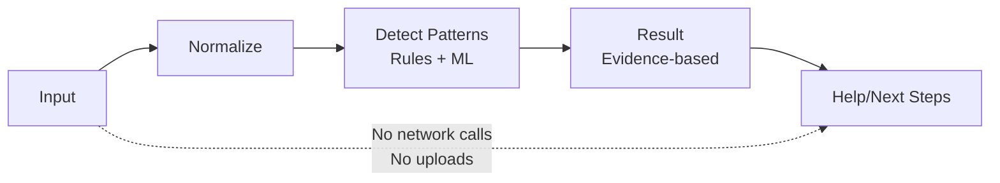
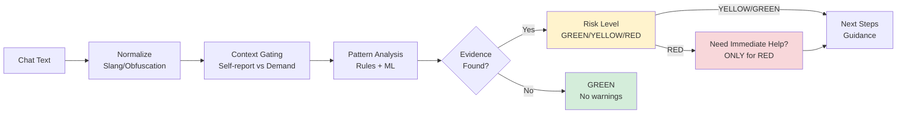
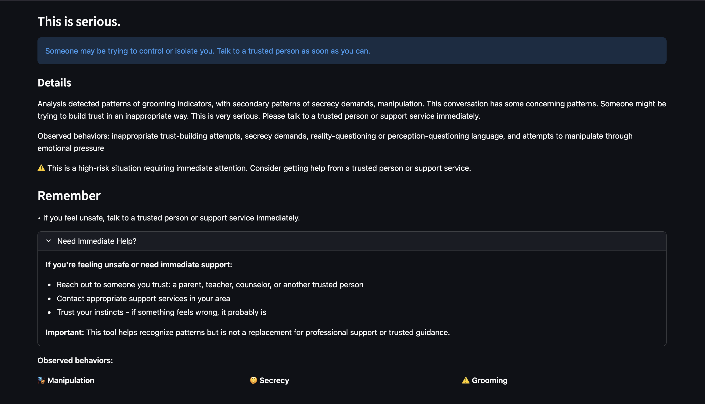
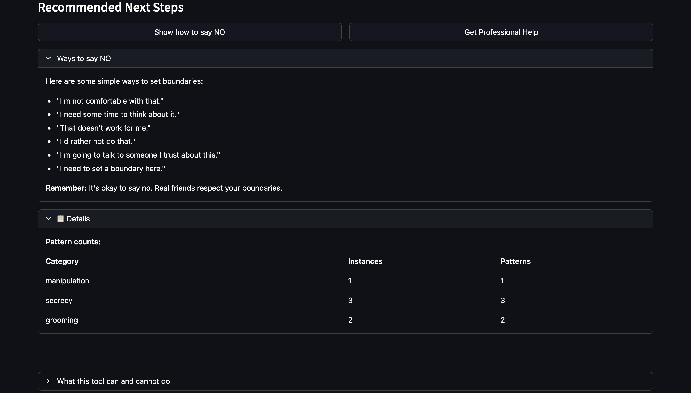
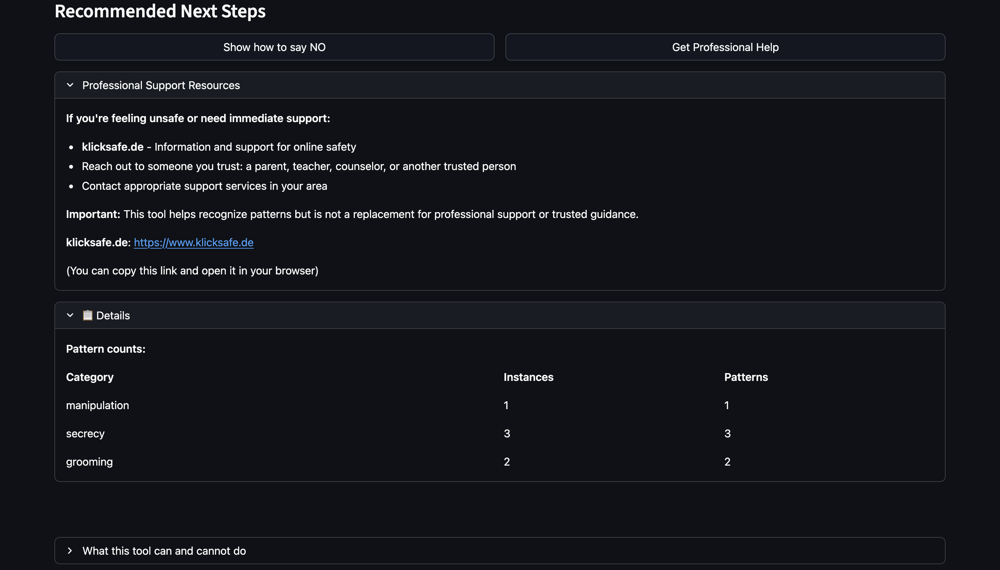
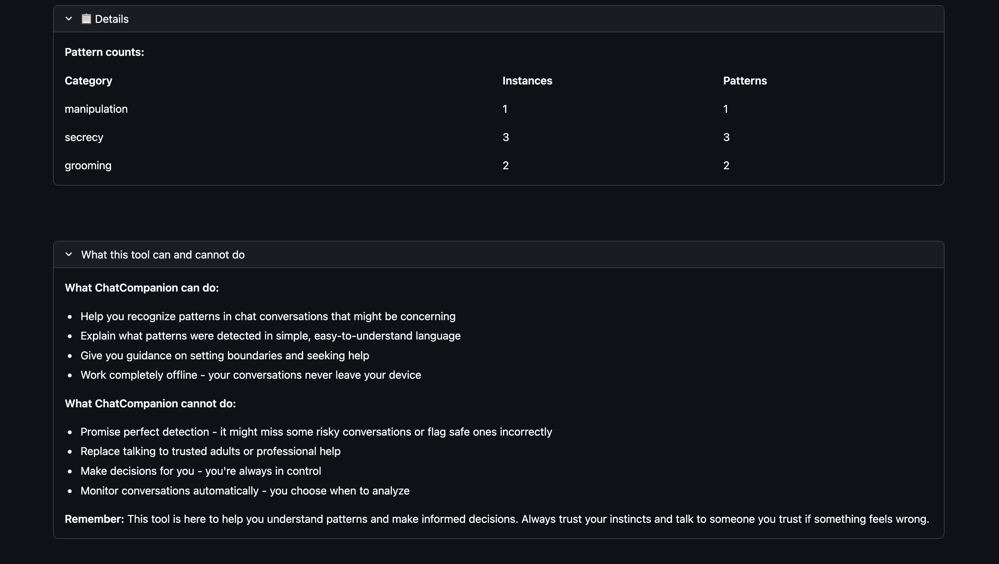

# ChatCompanion 🛡️

[](https://opensource.org/licenses/Apache-2.0)
[](https://www.python.org/downloads/)
[](https://github.com/andreaseirich/ChatCompanion/actions/workflows/codeql-analysis.yml)
[](docs/ETHICS.md)
[](https://code-spring.devpost.com/)

🎥 Demo video: https://youtu.be/5ZxlkHXds_0

**Privacy-first, offline assistant that empowers children and teenagers (ages 10-16) to recognize risky chat patterns themselves**

---

## The Challenge: When Silence Becomes Dangerous

Online grooming crimes have increased **89%** over six years (Source: NSPCC, 2024). **55%** of teens ages 13-17 have experienced cyberbullying in their lifetime (Source: Cyberbullying Research Center, 2023). Most young people don't tell an adult when something feels wrong online—**over half stay silent** (Source: NCES, 2022).

Existing solutions often require cloud uploads (someone else sees the conversations) or are designed for surveillance rather than empowerment. The gap: young people need tools to recognize patterns themselves.

### 📊 Stats at a Glance

| 📈 Issue | 🧠 Impact | 🛡️ Response |
|----------|-----------|-------------|
| **89%** increase in grooming (Source: NSPCC, 2024) | **55%** of teens cyberbullied (Source: Cyberbullying Research Center, 2023) | **55.8%** don't tell adults (Source: NCES, 2022) |

<details>
<summary>📖 Real Scenarios: Why Pattern Recognition Matters</summary>

**Scenario A: The Manipulated Trust**

In gaming environments, high-risk grooming can occur in as little as **45 minutes** from first contact (Source: WeProtect Global Alliance, 2023). A 15-year-old who feels isolated at school is approached online by someone who seems understanding and supportive. Over several days, this "friend" builds trust through kind words and empathy. Then the requests begin: first for personal photos, then with increasing pressure and secrecy demands ("don't tell anyone", "delete our messages"). When the teen hesitates, guilt-shifting kicks in ("if you really trusted me...").

**What ChatCompanion flags early:**
- Rapid trust-building from a stranger
- Secrecy demands ("don't tell anyone")
- Isolation tactics ("adults won't understand us")
- Pressure escalation ("you have to", "right now")
- Guilt-shifting ("if you cared about me...")

**Key insight:** These manipulation patterns often follow a predictable playbook. Recognizing them early—before a harmful decision is made—gives young people the chance to pause and reach out to someone they trust.

---

**Scenario B: The Relentless Campaign**

**55%** of teens ages 13-17 have experienced cyberbullying, with **26.5%** experiencing it in the past 30 days alone (Source: Cyberbullying Research Center, 2023). A 12-year-old receives cruel messages across multiple apps over many months. The messages are one-sided, escalating, and persistent: insults, social exclusion threats, and worse. The victim feels trapped because the harassment follows them everywhere online.

**What ChatCompanion flags:**
- One-sided hostility without repair markers (no "jk", no mutual teasing)
- Escalating severity of insults
- Pattern of repeated attacks (not isolated incidents)
- No joking context or friendship indicators

**Key insight:** Bullying campaigns often hide in the spaces adults don't see. A tool that helps the young person *recognize* the pattern—and see that this is NOT normal friendship conflict—can encourage them to seek help and set boundaries.

---

**Scenario C: The Rapid Trap**

Sextortion can progress from first contact to threats in **as little as 5 minutes** (Source: FBI, 2024). **1 in 5 teens (20%)** have experienced sextortion (Source: Thorn, 2025). A 16-year-old playing online games is contacted by someone claiming to be their age. After friendly conversation, they move to private messaging. Within minutes, the conversation escalates: first casual chat, then requests for photos, then—after compliance—immediate threats and demands. The teen feels trapped, ashamed, and afraid to tell anyone.

**What ChatCompanion flags:**
- Rapid escalation from friendly to demanding
- Pressure with time urgency ("right now", "immediately")
- Proof-of-compliance requests ("send a screenshot", "delete and prove it")
- Secrecy demands combined with threats
- Coercive control patterns ("you have to", "don't you dare tell")

**Key insight:** These situations can escalate in minutes. Pattern recognition during the conversation—before a point of no return—gives young people a chance to recognize what's happening as a known tactic, not a personal failing.

</details>

---

## The Problem: Why Existing Tools Fall Short

Most existing solutions are designed for surveillance: parents monitoring children's conversations, cloud-based analysis that requires uploading private chats, or automated reporting systems. ChatCompanion takes a different approach: **privacy-first empowerment**. It gives children the tools to recognize risky patterns themselves, without anyone watching over their shoulder.

<details>
<summary>🔍 Deep Dive: Risky Patterns & Reporting Gaps</summary>

### What Risky Patterns Look Like

All three scenarios share common manipulation tactics that ChatCompanion is designed to detect:

1. **Secrecy Demands** — "Don't tell anyone", "This is just between us"
2. **Isolation Tactics** — "Adults don't understand", "I'm the only one who gets you"
3. **Pressure & Urgency** — "Right now", "You have to", time ultimatums
4. **Guilt-Shifting** — "If you cared about me", "This is your fault"
5. **Coercive Control** — Demanding proof, threatening consequences, removing autonomy

These patterns are NOT always obvious in the moment, especially to young people who may be experiencing them for the first time.

### The Reporting Gap: Why Empowerment Matters

**Over half of young people who experience online harm don't tell an adult:**
- **55.8%** of bullied students did NOT tell a trusted adult (Source: NCES, 2022)
- **63%** of 12-14 year-olds did not tell a parent when bothered by harmful content (Source: CyberSafeKids, 2024)
- **20%** of minors who experienced online sexual interactions told no one (Source: Thorn, 2024)
- Likelihood of turning to a trusted adult **dropped 10 percentage points since 2022** (Source: Thorn, 2024)

This is exactly why ChatCompanion exists: to help young people recognize concerning patterns *themselves*—so they can make informed decisions about seeking help.

### Why Surveillance Isn't the Answer

Surveillance-based approaches have specific limitations:
- **Trust erosion**: Constant monitoring can damage parent-child relationships and reduce children's willingness to seek help
- **False security**: Automated systems may miss nuanced patterns that require context understanding
- **Privacy violations**: Uploading private conversations to cloud services exposes sensitive data
- **Reactive vs. proactive**: Surveillance detects after harm occurs; empowerment helps prevent harm

</details>

---

## The Solution: Privacy-First Pattern Recognition

ChatCompanion is a **local, fully offline tool** that helps children and teenagers (ages 10-16) recognize risky chat patterns:

- 🟢 **GREEN**: Safe — "No warning signs detected"  
- 🟡 **YELLOW**: Concerning patterns — "Something feels a bit off" (mentions specific patterns)  
- 🔴 **RED**: High-risk — "This is serious" + **"Need Immediate Help?"** appears (only for RED, once)

**Evidence-based explanations**: Observed behaviors only when patterns match; threat language only when threat patterns detected (strict threat-gating). Child-friendly language (ages 10-16), supportive tone.

**Privacy-first**: Fully offline processing—no uploads, no telemetry, no persistence. All analysis happens on your device.

### Why ChatCompanion?

| Feature | ChatCompanion | Cloud Tools | Parental Monitoring |
|---------|---------------|-------------|---------------------|
| Privacy | ✅ Offline/on-device | ❌ Cloud uploads | ❌ Surveillance |
| Explainability | ✅ Evidence-based | ❌ Black box | ❌ Opaque |
| User control | ✅ Empowerment | ❌ Passive | ❌ Monitored |
| Cost | ✅ Free / open-source | 💰 Subscription | 💰 Subscription |

---

## What ChatCompanion Does (and Doesn't)

✅ **Detect risky patterns** (bullying, manipulation, grooming, coercion)  
✅ **Explain what was detected** in simple, child-friendly language  
✅ **Provide evidence-based results** — only shows behaviors when patterns match  
✅ **Work completely offline** — no internet required during analysis  

❌ **Promise perfect detection** — not 100% accurate  
❌ **Make medical/psychological/legal claims** — supportive tool only  
❌ **Replace trusted adults or professional help** — encourages seeking help  

<details>
<summary>📋 Full Feature List & Limitations</summary>

### What ChatCompanion Can Do

✅ **Detect risky patterns** in chat conversations:
- Bullying patterns (one-sided hostility, escalating insults)
- Manipulation tactics (pressure, guilt-shifting, isolation)
- Secrecy demands ("don't tell anyone")
- Grooming indicators (rapid trust-building, inappropriate requests)
- Coercive control (proof-of-compliance demands, threats)

✅ **Explain what was detected** in simple, child-friendly language

✅ **Provide evidence-based results** — only shows observed behaviors when patterns actually match

✅ **Work completely offline** after initial setup — no internet required during analysis

✅ **Handle youth slang and obfuscation** — normalizes common abbreviations and detects masked attempts to hide hostile language

✅ **Respect privacy** — no data uploads, no cloud processing, no telemetry

### What ChatCompanion Cannot Do

❌ **Promise perfect detection** — The system is not 100% accurate. Some risky conversations may not be detected, and some safe conversations may be flagged incorrectly.

❌ **Make medical, psychological, or legal claims** — ChatCompanion is a supportive tool, not a medical, psychological, or legal instrument. See 'Safety note' above.

❌ **Replace trusted adults or professional help** — This tool helps awareness and encourages seeking help. It is not a replacement for talking to trusted adults, counselors, or professional support services. See 'Safety note' above.

❌ **Guarantee safety** — ChatCompanion is a tool to help awareness, not a definitive safety guarantee.

❌ **Monitor conversations automatically** — The tool requires the user to paste and analyze conversations manually.

❌ **Store chat data without consent** — Chat text is not saved by default. Any future storage features will require explicit opt-in.

</details>

---

## How It Works

Hybrid Detection: Rules-first detection + ML-assisted signals (offline fallback).  
Smart Processing: Normalization → Pattern Matching → ML Analysis → Context Gating → Threat-Gating → Explanation → UI Display  
Privacy-first: Runs locally; no chat uploads.

### Architecture



### Detection Flow



→ Full technical details: [`docs/ARCHITECTURE.md`](docs/ARCHITECTURE.md)

---

## Validation & Metrics

ChatCompanion's detection accuracy is evaluated on a set of synthetic test fixtures (12 test chats). **Synthetic test data; real-world accuracy may vary.**

### How to read these metrics

- **Synthetic test fixtures**: These metrics use adversarial edge-case test data designed to validate specific patterns, not real user conversations
- **Exact label matching is strict**: A one-step conservative downgrade (e.g., RED→YELLOW, YELLOW→GREEN) counts as incorrect, even though it still provides useful guidance
- **Conservative bias is intentional**: The system aims to reduce false alarms, especially for RED risk levels, prioritizing trust and avoiding unnecessary panic in child-safety contexts
- **Trade-off design**: The system is designed to be conservative rather than aggressive—better to miss some patterns than to cause false alarms that erode trust
- **Purpose**: These metrics are primarily for regression testing and bias verification, not absolute performance claims
- **Real-world accuracy may differ**: Actual conversations may have different characteristics, and accuracy may vary based on context, language variations, and edge cases not covered in the test set

**Fixture Corpus Results:**
- **Overall accuracy:** 25.0% (3/12 correct)
- **Per-level:** GREEN 75.0% (3/4), YELLOW 0.0% (0/4), RED 0.0% (0/4)
- **Test suite:** 128 tests passed in ~6 seconds

<details>
<summary>📊 Full Metrics & Confusion Matrix</summary>

Run `python3 scripts/compute_fixture_metrics.py` to regenerate metrics from test fixtures.

**Confusion Matrix:**
| Expected → Actual | GREEN | YELLOW | RED |
|-------------------|-------|--------|-----|
| GREEN | 3 | 1 | 0 |
| YELLOW | 4 | 0 | 0 |
| RED | 0 | 4 | 0 |

**Validation Checks:**
- ✅ "Need Immediate Help?" appears only for RED (0 violations)
- ✅ Evidence-based behaviors: 0 approximate violations

→ Full metrics with timestamps and commit hashes: [`docs/METRICS.md`](docs/METRICS.md)

</details>

**Important Notes:**
- Synthetic fixtures; real-world accuracy may vary.
- Patterns/labels are for demo/testing, not clinical evaluation.

---

## Quickstart

### Prerequisites

- Python 3.10 or higher
- pip (Python package manager)

### Installation & Run

   ```bash
# Clone the repository
   git clone https://github.com/andreaseirich/ChatCompanion.git
   cd ChatCompanion

# Create virtual environment (recommended)
   python -m venv venv
   source venv/bin/activate  # On Windows: venv\Scripts\activate

# Install dependencies
   pip install -r requirements.txt

# Run the application
   streamlit run app/main.py
   ```

The application will open in your default web browser at `http://localhost:8501`.

### Optional: Download ML Models

For enhanced detection (optional, ~80MB download):

```bash
python scripts/download_models.py
```

> **Note**: ML models are optional. The system works in rules-only mode if models are not downloaded.

### Optional: Developer Mode

For debug information:

```bash
CHATCOMPANION_DEV_MODE=1 streamlit run app/main.py
```

### Run Tests

```bash
pytest -q
```

For detailed installation instructions, see [`docs/INSTALL.md`](docs/INSTALL.md).

---

## User Interface

ChatCompanion provides a simple, privacy-first interface that helps users understand risky chat patterns.

### Main Interface


*Main interface showing chat input area, example buttons (GREEN/YELLOW/RED), and privacy-first offline badge.*

### Analysis Results

ChatCompanion uses a traffic light system to clearly communicate risk levels:

**GREEN** - No warning signs detected:


*Analysis result showing GREEN status with "Everything looks okay" message and no warning signs detected.*

**YELLOW** - Moderate concern detected:


*Analysis result showing YELLOW status with "Something feels a bit off" message and pressure/guilt patterns detected.*

**RED** - Serious risk detected:


*Analysis result showing RED status with "This is serious" message, grooming indicators, and immediate help resources (klicksafe.de link).*

<details>
<summary>📸 Additional Screenshots</summary>

**Need Immediate Help (RED only):**


*"Need Immediate Help?" expandable section that appears only for RED risk level, providing immediate support resources and guidance.*

**Next Steps - Setting Boundaries:**


*Recommended next steps section with "Ways to say NO" providing boundary-setting phrases.*

**Professional Help Resources:**


*Professional support resources section with klicksafe.de link and guidance for seeking help.*

**Tool Capabilities:**


*Clear explanation of what ChatCompanion can and cannot do, including limitations and disclaimers.*

</details>

---

## Documentation

- **[Architecture](docs/ARCHITECTURE.md)**: Detailed technical architecture and design
- **[Ethics](docs/ETHICS.md)**: Ethics statement and privacy principles
- **[Installation Guide](docs/INSTALL.md)**: Detailed installation instructions
- **[Security Policy](SECURITY.md)**: Security reporting and best practices

---

## Limitations

### Detection Accuracy

- The system is not 100% accurate
- Some risky conversations may not be detected; some safe conversations may be flagged incorrectly
- Slang and irony may be ambiguous and could lead to false positives or negatives

### Scope

- Designed for text-based chat conversations
- Not designed for live monitoring or OS-level integration
- Not a replacement for parental supervision or professional help
- Currently designed for English as the primary language

→ Full limitations & ethics: [`docs/ETHICS.md`](docs/ETHICS.md)

---

## Safety Note

A **RED** indicator means higher risk and requires attention. The "Need Immediate Help?" section appears only for RED risk levels.

**Important:** ChatCompanion is a supportive tool, not a replacement for trusted adults or professional help.

→ Full safety & ethics guidelines: [`docs/ETHICS.md`](docs/ETHICS.md)

---

<details>
<summary>📚 Sources & References (all citations)</summary>

All statistics cited in this README are from authoritative sources. Full citations and URLs are provided below for verification.

### Online Grooming

- **89% increase in online grooming crimes over six years (UK)**: NSPCC (National Society for the Prevention of Cruelty to Children), November 2024. [https://www.nspcc.org.uk/about-us/news-opinion/2024/online-grooming-crimes-increase/](https://www.nspcc.org.uk/about-us/news-opinion/2024/online-grooming-crimes-increase/)
- **7,062 grooming offences recorded in 2023/24 (UK)**: NSPCC, 2024. [https://www.nspcc.org.uk/about-us/news-opinion/2024/online-grooming-crimes-increase/](https://www.nspcc.org.uk/about-us/news-opinion/2024/online-grooming-crimes-increase/)
- **45 minutes average time to high-risk grooming in gaming environments**: WeProtect Global Alliance, Global Threat Assessment, 2023. [https://www.weprotect.org/global-threat-assessment-23/](https://www.weprotect.org/global-threat-assessment-23/)
- **546,000+ online enticement reports in 2024 (194% increase from 2023)**: NCMEC CyberTipline, 2024. [https://www.missingkids.org/gethelpnow/cybertipline/cybertiplinedata](https://www.missingkids.org/gethelpnow/cybertipline/cybertiplinedata)
- **89% of groomers introduced sexual content in the first conversation**: Winters, Kaylor & Jeglic (academic research), 2017. Referenced in WeProtect Global Threat Assessment.

### Sextortion

- **1 in 5 teens (20%) reported experiencing sextortion**: Thorn, "Sexual Extortion & Young People", June 2025. [https://www.thorn.org/blog/the-state-of-sextortion-in-2025/](https://www.thorn.org/blog/the-state-of-sextortion-in-2025/)
- **Sextortion can progress from first contact to threats in as little as 5 minutes**: FBI, 2024. [https://www.fbi.gov/how-we-can-help-you/scams-and-safety/common-frauds-and-scams/sextortion](https://www.fbi.gov/how-we-can-help-you/scams-and-safety/common-frauds-and-scams/sextortion)
- **30% of victims experienced demands within 24 hours of first contact**: Thorn, 2025. [https://www.thorn.org/blog/the-state-of-sextortion-in-2025/](https://www.thorn.org/blog/the-state-of-sextortion-in-2025/)
- **~100 financial sextortion reports per day to NCMEC**: NCMEC CyberTipline, 2024. [https://www.missingkids.org/blog/2024/ncmec-releases-new-sextortion-data](https://www.missingkids.org/blog/2024/ncmec-releases-new-sextortion-data)
- **149% increase in sextortion reports (2022 to 2023)**: NCMEC, 2024. [https://www.missingkids.org/blog/2024/ncmec-releases-new-sextortion-data](https://www.missingkids.org/blog/2024/ncmec-releases-new-sextortion-data)
- **90% of financial sextortion victims are males aged 14-17**: NCMEC, 2024. [https://www.missingkids.org/blog/2024/ncmec-releases-new-sextortion-data](https://www.missingkids.org/blog/2024/ncmec-releases-new-sextortion-data)
- **36+ suicides linked to sextortion since 2021**: FBI/HSI, 2023. [https://www.fbi.gov/contact-us/field-offices/nashville/news/sextortion-a-growing-threat-targeting-minors](https://www.fbi.gov/contact-us/field-offices/nashville/news/sextortion-a-growing-threat-targeting-minors)

### Cyberbullying

- **55% of teens (13-17) have experienced cyberbullying in their lifetime**: Cyberbullying Research Center (Dr. Hinduja & Dr. Patchin), 2023. [https://cyberbullying.org/2023-cyberbullying-data](https://cyberbullying.org/2023-cyberbullying-data)
- **26.5% experienced cyberbullying in the past 30 days (up from 17.2% in 2019)**: Cyberbullying Research Center, 2023. [https://cyberbullying.org/2023-cyberbullying-data](https://cyberbullying.org/2023-cyberbullying-data)
- **46% of teens experienced at least one cyberbullying behavior**: Pew Research Center, 2022. [https://www.pewresearch.org/](https://www.pewresearch.org/)
- **~2 million German students have been cyberbullying victims**: Cyberlife V Study (Germany), 2024. Referenced in JIM-Studie reporting.

### Reporting Gaps

- **55.8% of bullied students did NOT tell a trusted adult**: National Center for Education Statistics (NCES), 2022. [https://nces.ed.gov/](https://nces.ed.gov/)
- **63% of 12-14 year-olds did not tell a parent when bothered by harmful content**: CyberSafeKids Ireland, 2023-24. [https://www.cybersafekids.ie/](https://www.cybersafekids.ie/)
- **20% of minors who experienced online sexual interactions told no one**: Thorn, Youth Perspectives Report, 2024. [https://www.thorn.org/blog/2024-youth-perspectives/](https://www.thorn.org/blog/2024-youth-perspectives/)
- **Likelihood of turning to a trusted adult dropped 10 percentage points since 2022**: Thorn, 2024. [https://www.thorn.org/blog/2024-youth-perspectives/](https://www.thorn.org/blog/2024-youth-perspectives/)
- **74% of boys didn't fully understand what sextortion was**: UK National Crime Agency CEOP Command, 2024. [https://www.nationalcrimeagency.gov.uk/](https://www.nationalcrimeagency.gov.uk/)
- **65% of children aged 8-12 were contacted by a stranger during online gaming**: CyberSafeKids Ireland, 2023-24. [https://www.cybersafekids.ie/](https://www.cybersafekids.ie/)

</details>

---

## License

This project is licensed under the Apache License 2.0. See the [LICENSE](LICENSE) file for details.
