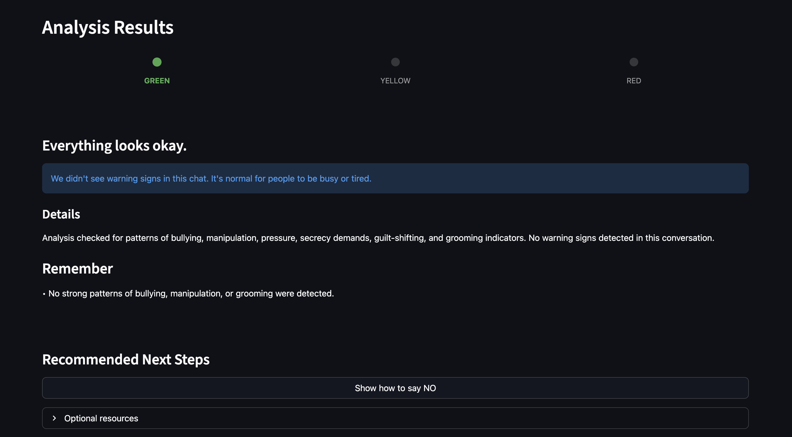
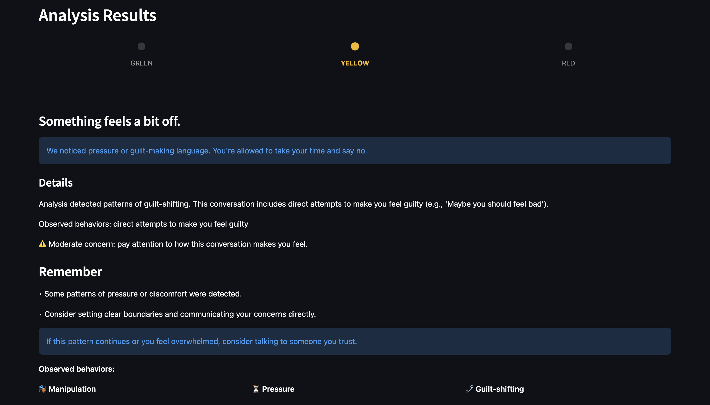
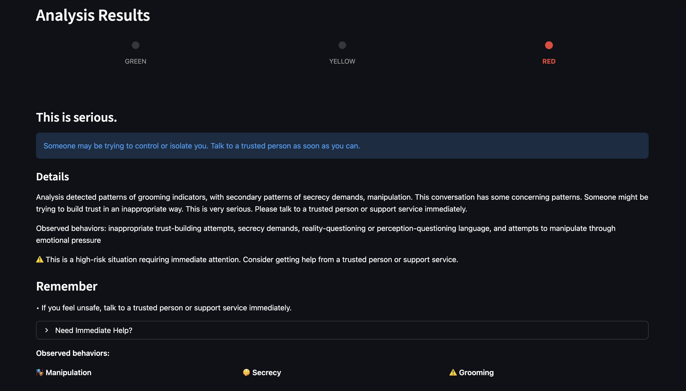

# Devpost Submission Content

This document contains the content for the CodeSpring Devpost submission form.

**Hackathon**: CodeSpring - Where Ideas Bloom into Innovation  
**Submission Date**: 2025-12-27  
**Repository**: https://github.com/andreaseirich/ChatCompanion

---

## Project Name

**ChatCompanion**

---

## Tagline

**Privacy-first assistant to help children and teenagers recognize risky chat patterns**

---

## Problem Statement

Children and teenagers face increasing risks in online communication:
- **Bullying**: Mean comments, insults, and social exclusion
- **Manipulation**: Pressure to do things they don't want to do
- **Grooming**: Inappropriate behavior from adults or peers
- **Secrecy Demands**: Requests to keep conversations hidden from trusted adults
- **Guilt Shifting**: Being blamed for someone else's actions

Many existing solutions require cloud uploads, lack explainability, or are designed for surveillance rather than empowerment. Children need a tool that helps them recognize risky patterns while maintaining their privacy and autonomy.

---

## Solution Approach

ChatCompanion is a **local, fully offline tool** that:

1. **Analyzes chat conversations locally** - No data is uploaded, no cloud processing
2. **Explains detected patterns** - Clear, child-friendly explanations of what was found and why
3. **Uses a traffic light system** - Visual green/yellow/red indicators for quick understanding
4. **Empowers children** - Helps them recognize patterns and seek help, without surveillance

**Key Differentiators**:
- **Privacy-first**: All processing happens on the user's device
- **Explainable**: Every detection includes evidence and reasoning
- **Child-friendly**: Simple language suitable for ages 10-16
- **Offline-capable**: Works completely offline after initial setup

---

## Visual Demo

### Main Interface


*Privacy-first interface with offline badge, example buttons, and local processing guarantee.*

### Traffic Light System

ChatCompanion uses a clear visual indicator system to communicate risk levels:

**GREEN** - Safe conversation:


**YELLOW** - Moderate concern:


**RED** - Serious risk (with immediate help resources):


### Key Features Demonstrated

**Evidence-Based Explanations:**
- Pattern counts table shows exactly what was detected
- Observed behaviors are listed only when patterns match
- Clear, child-friendly language explains what was found

**Empowerment & Support:**
- "Ways to say NO" provides boundary-setting phrases
- "Need Immediate Help?" section appears only for RED cases (with klicksafe.de link)
- Professional help resources for serious situations
- Clear disclaimers about tool limitations

**Privacy-First Design:**
- "Offline / on-device" badge prominently displayed
- No cloud uploads, no data persistence
- User controls when to analyze

---

## Tech Stack

### Core Technologies
- **Python 3.10+**: Backend language
- **Streamlit**: Web-based UI framework
- **sentence-transformers**: Local NLP embeddings (all-MiniLM-L6-v2, ~80MB)
- **scikit-learn**: Machine learning utilities
- **YAML**: Rule configuration

### Detection Approach
- **Hybrid Detection**: Combines rule-based pattern matching (60%) with ML semantic analysis (40%)
- **Rules-Only Fallback**: Works fully offline even if ML models aren't available
- **Explainable Results**: Every detection includes evidence and reasoning
- **Evidence-Based Explanations**: Observed behaviors are listed only when supported by matched patterns

### Architecture
- **Modular Design**: Clear separation of concerns (UI, detection, rules, models)
- **Slang Normalization**: Handles English youth/online slang and abbreviations
- **Context Gating**: Reduces false positives by analyzing context
- **Threat-Gating**: Threat language appears only when threat patterns are actually detected

See [`docs/ARCHITECTURE.md`](ARCHITECTURE.md) for detailed technical documentation.

---

## How to Run

### Quick Start

1. **Clone the repository**
   ```bash
   git clone https://github.com/andreaseirich/ChatCompanion.git
   cd ChatCompanion
   ```

2. **Create a virtual environment**
   ```bash
   python -m venv venv
   source venv/bin/activate  # On Windows: venv\Scripts\activate
   ```

3. **Install dependencies**
   ```bash
   pip install -r requirements.txt
   ```

4. **Download ML models** (optional, for enhanced detection)
   ```bash
   python scripts/download_models.py
   ```
   > **Note**: ML models are optional. The system works in rules-only mode if models are not downloaded.

5. **Run the application**
   ```bash
   streamlit run app/main.py
   ```

The application will open at `http://localhost:8501`.

### Setup Time
- **With ML models**: ~5-10 minutes (includes model download)
- **Rules-only mode**: ~2-3 minutes (no model download needed)

### Runtime
- **Fully offline**: No internet required after setup
- **No data uploads**: All processing happens locally
- **No telemetry**: No tracking or analytics

---

## What's Next

### Immediate Next Steps
- **Demo video**: Record and upload 3-minute demo video
- **Screenshots**: Add visual demonstrations to README
- **User testing**: Get feedback from target age group (10-16)

### Future Enhancements
- **Multi-language support**: Extend beyond English
- **Standalone executable**: One-click installer for non-technical parents
- **Browser extension**: Direct integration with messaging platforms
- **Mobile app**: Native iOS/Android apps
- **Advanced ML models**: Fine-tuned models for better accuracy
- **Custom risk categories**: User-configurable detection patterns

### Long-Term Vision
ChatCompanion aims to become a trusted tool that helps children navigate online communication safely, while maintaining their privacy and autonomy. We envision a future where children are empowered to recognize and respond to risky patterns, with tools that support rather than surveil.

---

## Key Features

✅ **Chat Text Analysis**
- Paste any chat conversation for analysis
- Demo chat examples included for testing

✅ **Risk Detection**
- Bullying patterns
- Manipulation tactics
- Emotional pressure
- Secrecy demands
- Guilt shifting
- Grooming indicators

✅ **Traffic Light Indicator**
- 🟢 Green: Safe conversation - "No warning signs detected"
- 🟡 Yellow: Some concerning patterns - "Something feels a bit off"
- 🔴 Red: High-risk situation - "Need Immediate Help?" section appears

✅ **Child-Friendly Explanations**
- Simple language suitable for ages 10-16
- Clear, calm titles and messages for each risk level
- Evidence-based: Observed behaviors listed only when supported by matched patterns
- Supportive, non-shaming tone

✅ **Privacy & Safety**
- Fully offline processing
- No data persistence by default
- No telemetry or tracking
- Explicit consent required for any future storage features

---

## Limitations

ChatCompanion is a **tool to help awareness**, not a definitive safety guarantee:

- **Not 100% accurate**: Some risky conversations may not be detected, some safe conversations may be flagged incorrectly
- **Slang and irony**: May be ambiguous and could lead to false positives or negatives
- **Context-dependent**: Tone, sarcasm, and cultural context may be misinterpreted
- **Not a replacement**: Does not replace professional help, counseling, or trusted adult guidance
- **English-only**: Currently designed for English as the primary language

See [`docs/ETHICS.md`](ETHICS.md) for detailed limitations and ethical considerations.

---

## Testing

Run the test suite:
```bash
pytest tests/
pytest tests/ -v  # verbose
pytest tests/ --cov=app  # with coverage
```

Test coverage includes:
- Detection engine tests
- Rules engine tests
- Model tests
- Explanation accuracy tests
- False positive handling
- Youth slang and banter detection

---

## Documentation

- **[README.md](../README.md)**: Project overview and quick start
- **[ARCHITECTURE.md](ARCHITECTURE.md)**: Technical architecture and design
- **[ETHICS.md](ETHICS.md)**: Ethics statement and privacy principles
- **[SECURITY.md](../SECURITY.md)**: Security policy
- **[INSTALL.md](INSTALL.md)**: Detailed installation guide

---

## License

This project is licensed under the Apache License 2.0. See the [LICENSE](../LICENSE) file for details.

---

## Acknowledgments

Built for the "Code Spring – Where Ideas Bloom into Innovation" hackathon.

Special thanks to:
- The open-source community for excellent tools (sentence-transformers, Streamlit, scikit-learn)
- Ethical AI researchers who prioritize explainability and privacy
- The CodeSpring organizers for creating this opportunity

---

**Remember**: ChatCompanion is a tool to help awareness and encourage seeking help. It is not a replacement for talking to trusted adults or professional support. Always trust your instincts and seek help when something feels wrong.

